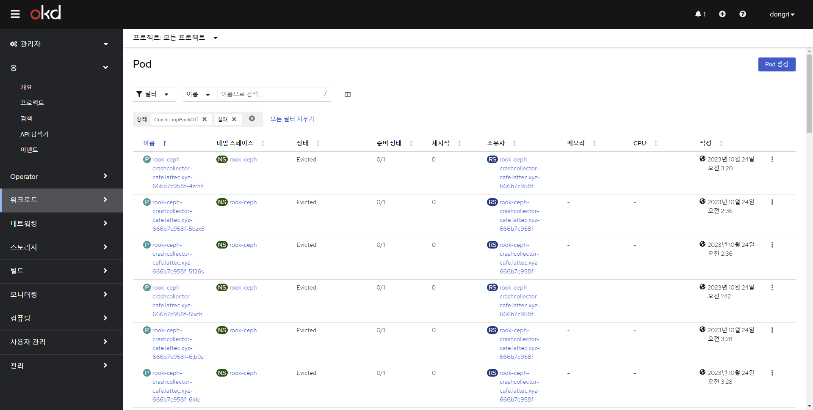

# 진행하면서 발생한 오류 정리

## CloudFlare DNS 등록 오류 
> 오류 내용
>> This record type cannot be proxied. (CODE: 9004) ERROR

> 해결
>>내부 IP 사용(외부 - 공유기 - 내부 구조) 시, CloudFlare의 Reverse Proxy를 사용할 수 없음.

## Issue 1. DHCP 오류 
> 오류 내용
>> Ignition 파일로 부팅하는데 DNS를 못찾았음

> 해결
>> DHCP 설정에서 Name서버 설정이 필요없다고 했는데 사실 필요했던거임 추가해서 해결

## Issue 2. Pod Evicted 문제
> 오류 내용
>> 대부분의 Pod이 Evicted 상태로 Pod이 늘어남

> 해결
>> 노드가 Disk Pressure 상태여서 Disk를 늘려서 해결함.

